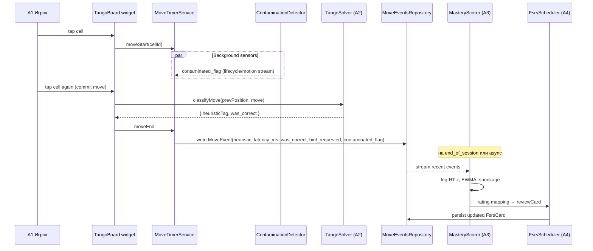

# feat: Tango Trainer Flutter MVP

## Overview

Greenfield Flutter-приложение: персональный тренажёр LinkedIn Tango с per-heuristic mastery, FSRS-планировщиком drill-сессий, локальной диагностикой по converging-evidence (latency + hint + ошибки) и contamination-фильтром. Один пользователь, оффлайн, без сервера, без рекламы. План разбит на 4 фазы (Foundation → Solver → Engine → UX) и закладывает `PuzzleKind`-интерфейс минимально-достаточно — Tango будет первой и единственной реализацией в v1.

**Целевая платформа v1:** Android (только Android-устройство у разработчика). Код cross-platform-friendly (Flutter), iOS-совместимость не ломаем, но не тестируем.

**State management:** Bloc 9.x (выбор пользователя).

---

## Problem Frame

Стандартные пазл-приложения дают только сам пазл и таймер; они не различают, *какие* техники медленные, и не дают точечной тренировки именно на слабых. Цель — личный тренажёр, который наблюдает за обычной игрой, диагностирует слабые именованные дедукции и подаёт точечные drill-ситуации именно на слабых техниках через FSRS-очередь. Полностью локально (sqlite), без сервера, без облака, без рекламы. (см. origin: `docs/brainstorms/2026-05-01-tango-trainer-requirements.md`)

---

## Requirements Trace

Все 33 требования origin переносятся как R-IDs и реализуются через unit-ы (см. таблицу ниже). Список техник MVP-каталога: `PairCompletion`, `TrioAvoidance`, `ParityFill`, `SignPropagation`, `AdvancedMidLineInference`, `ChainExtension`, `Composite(unknown)` (R2). UI-имена техник — через `displayName` (R33), движковые `tagId` не меняются.

| Group | R-IDs |
|---|---|
| Solver & catalog | R1, R2 |
| Drill mechanics | R3, R4, R5, R6, R29, R30 |
| Mastery & scheduler | R7, R8, R9, R10, R11 |
| Hint ladder | R12, R13 |
| Telemetry & contamination | R14, R15, R16, R31 |
| Replay-as-tutor | R17, R18, R32 |
| Generator | R19, R20, R21 |
| Progress UX | R22, R23, R24 |
| Anti-burnout | R25 |
| Pluggable arch | R26 |
| Local & ad-free | R27, R28 |
| Naming & UX display | R33 |

**Origin actors:** A1 (Игрок), A2 (Solver-движок), A3 (Diagnostic engine), A4 (Drill-планировщик), A5 (Генератор уровней).
**Origin flows:** F1 (обычная партия как источник диагностики), F2 (Drill-сессия 10+10 + ChainDrill), F3 (Hint-as-diagnostic-signal), F4 (Просмотр прогресса).
**Origin acceptance examples:** AE1 (R3, R6), AE2 (R12, R13), AE3 (R10), AE4 (R5), AE5 (R15), AE6 (R17), AE7 (R22, R23, R24), AE8 (R25), AE9 (R29, R30), AE10 (R31, R32).

> **Note:** R29–R33 и AE9–AE10 добавлены addendum-ом после завершения Phase B. См. [`docs/tango_trainer_concept_addendum.md`](../tango_trainer_concept_addendum.md) для контекста и mapping движковой ↔ UX-таксономии. Engine-код Phase A/B этими требованиями не затронут; реализация — в Phase C (telemetry-поля) и Phase D (UX и drill-mechanics).

---

## Scope Boundaries

- Никакой облачной синхронизации, аккаунтов, leaderboards, рекламы, сторонних analytics (R27, R28).
- Никакого «агента, который играет за тебя».
- В drill подаются только техники из MVP-каталога; `Composite(unknown)` логируется, но в drill не выходит.
- Никакого «диагностического онбординга» — cold-start = обычные партии (R10).
- Никаких других пазлов (Queens/Zip/Binairo) в v1 — только Tango. `PuzzleKind`-интерфейс заложен, но реализация одна (R26).
- Никакого hard-cap или freeze-очереди — только soft-nudge (R25).
- Никаких индикаторов прогресса в игровом процессе — только end-of-session summary и Mastery-экран (R22, R23).
- Eye-tracking / dwell-time / heatmap взгляда, Watch-приложение, voice-input, multi-solution puzzles, variable grid size, LinkedIn-mirror mode — все отложены.

### Deferred to Follow-Up Work

- **Калибровка FSRS-параметров** на личных данных: после ~3 месяцев логов (~500–1500 событий). До этого момента — stock FSRS-6 defaults `fsrs` пакета.
- **Per-technique idle-thresholds** (R15) на основе p99 латентности техники: после ~2 недель данных. До этого — глобальный 8-сек soft-сигнал и абсолютный stationary 30-сек hard-сигнал.
- **Расширение каталога эвристик** при накоплении статистики `Composite(unknown)`.

---

## Context & Research

### Relevant Code and Patterns

Greenfield: ничего нет, кроме `docs/`. Все patterns берутся из внешних источников.

### Institutional Learnings

`docs/solutions/` отсутствует. По мере работы над MVP — заполнять.

### External References

**Solver:**
- `brohitbrose/linkedin-games` (JS, MIT) — deduction-first solver с line-level backtrack. Используется как **correctness oracle / тестовый референс**, не порт. Эвристики совпадают с Takuzu/Binairo каноном.
- Lunavi blog «Creating a Solver for LinkedIn's Tango Puzzle Game», Wikipedia Takuzu, Utomo & Makarim (SAT/Gröbner).

**FSRS:**
- `fsrs` v2.0.0+ (pub.dev, open-spaced-repetition org) — pure Dart, FSRS-5/6, 21-параметр weights, API `Scheduler.reviewCard()` + `Rating { Again, Hard, Good, Easy }`. Production-used (SpacedCards iOS).
- Stock OSR/fsrs4anki defaults; `desired_retention` = 0.9. Не оптимизируем параметры в v1 — нужны >400 reviews.
- fsrs4anki wiki «The Algorithm», Expertium «FSRS Algorithm explained».

**Mastery & RT analysis:**
- Frontiers 2021 (RT outlier exclusion): log-transform RT, drop > 3 SD на log-шкале.
- Schubert et al. 2022 (Worst Performance Rule): медиана + p25/p75 устойчивее среднего; lapses доминируют в slow-tail.
- EWMA (Stanford, Luxenberg & Boyd) для streaming RT; α≈0.1 ≈ N≈20.
- Empirical-Bayes shrinkage с pseudo-count k=10 для cold-start.
- Анти-burnout (leananki, iatroX): 15–30 мин/день sustainable; ~20 drill × 45 сек ≈ 15 мин — sweet spot.

**Flutter stack (Q2 2026):**
- `drift` ~2.32.x (type-safe SQLite, MigrationStrategy, streams).
- `flutter_bloc` ^9.0.0 (выбор пользователя).
- `sensors_plus` ~6.x (`userAccelerometerEventStream` с вычтенной гравитацией).
- `fl_chart` ~0.69.x (`RadarChart` widget).
- `AppLifecycleListener` (Flutter 3.13+, callback-based, чище для тестирования чем `WidgetsBindingObserver`).
- Pitfall: Android иногда не зовёт `paused` (Flutter issue #124591) → motion-detection обязателен как независимый сигнал.
- Pitfall: iOS зовёт `inactive` агрессивно → debounce 500 ms.

---

## Key Technical Decisions

- **Решение:** Solver писать нативно на Dart, brohitbrose использовать как тестовый oracle (генерим позиции, сравниваем доступные дедукции).
  **Rationale:** ~2–3 дня работы, никаких JS↔Dart impedance проблем, brohitbrose без авторитетного спека техник, у нас своя именованная таксономия из 7 техник, не совпадающая 1:1 с его 6 line-rules.

- **Решение:** Маппинг brainstorm-каталога на line-rules. `TrioAvoidance` ↔ pair-forced (anti-triple). `ParityFill` ↔ count-balance (квота строки исчерпана). `SignPropagation` ↔ sign-propagation. `PairCompletion` + `AdvancedMidLineInference` ↔ gap-sandwich + equals-middle. `ChainExtension` — meta-эвристика (новая дедукция доступна сразу после хода). `Composite(unknown)` — fallback line-backtrack.
  **Rationale:** product-facing именование сохраняем, реализационный маппинг документирован в коде solver-а.

- **Решение:** FSRS — `fsrs` v2.0.0 напрямую, **один shared param set** на все 7 техник в v1. Per-technique calibration отложена в Follow-Up.
  **Rationale:** для per-set оптимизации FSRS требует ~400 reviews; у нас 7×<400 ≪ 2800 на горизонт месяцев. Single shared params + один пользователь — стандарт Anki при low-volume.

- **Решение:** Маппинг converging-evidence в FSRS Rating: `Again` если error ИЛИ hint-step ≥ 2; `Hard` если hint-step = 1 ИЛИ contamination-recovery; `Good` если correct без hint и в пределах p75 baseline; `Easy` если correct и ≤ p25 baseline.
  **Rationale:** связывает 4-сигнальную диагностику с native FSRS API без её упрощения до бинарного «знал/не знал».

- **Решение:** Mastery-формула — log-RT vs solver-baseline → z → percentile (normal CDF), EWMA(α=0.1, N≈20), Bayesian shrinkage с k=10 в population mean. Drop >3 SD log-RT outliers и contaminated.
  **Rationale:** компонует стандартные практики; для one-user системы learning-моделей нет смысла. Документировать как «начальная композиция, валидация по жалобе глаза владельца».

- **Решение:** Converging-evidence — hand-tuned weighted scalar для weakness-score: `0.4·percentile_latency + 0.3·error_rate + 0.2·hint_rate + 0.1·max_hint_step`. Веса не учим.
  **Rationale:** один пользователь, статистической мощности на learnable weights нет; transparent + tunable вручную.

- **Решение:** Contamination = OR двух сигналов: (1) `AppLifecycleState.paused` (с возвратом > 0 — instant flag), (2) `userAccelerometerEventStream` неподвижен > 30 сек. Idle > 8 сек — soft-сигнал в логе, в contamination не превращается до калибровки p99 техники.
  **Rationale:** Android не всегда зовёт `paused`; sensors_plus резервирует. 8-сек idle ловит нормальное обдумывание сложных техник (AdvancedMidLineInference) — вредно как hard-сигнал.

- **Решение:** Soft-nudge при N=20 drill-карточек/день (origin ориентир был 30). Дополнительный fatigue-trigger: error-rate последних 5 карточек > rolling avg → плашка.
  **Rationale:** drill-карточка ≈ 45 сек cognitive work × 20 ≈ 15 мин — Anki/SRS sweet-spot. 30 = на границе burnout по литературе.

- **Решение:** `PuzzleKind`-интерфейс минимально-достаточен. Граница абстракции = `Heuristic { kindId, tagId }` + `MoveEvent`. **Не делаем** generic-типизацию `PuzzleKind<TPosition,TMove>`, **не делаем** Constraint ADT. Tango-специфика (правила доски, sign-конструкции) — внутри `TangoPuzzleKind`, на интерфейс не вылезает.
  **Rationale:** YAGNI; абстракция стоит копить рефакторингом при добавлении второго пазла, не на пустом месте.

- **Решение:** Stack — Bloc 9.x + drift 2.32 + fsrs 2.0 + sensors_plus 6 + fl_chart 0.69 + AppLifecycleListener. Window R11 default = 7 дней (configurable). Cold-start = 10 событий (R10, поднимаем при нестабильности).
  **Rationale:** см. external references; user-выбор по state mgmt (Bloc).

---

## Open Questions

### Resolved During Planning

- **FSRS startup parameters** (R8): stock `fsrs` v2.0.0 OSR defaults, без оптимизации в v1.
- **Authoritative sources for deductions** (R1, R2): brohitbrose как correctness oracle + Takuzu/Binairo канон + Lunavi blog как cross-check.
- **Soft-nudge default N** (R25): 20.
- **Default 7-day window** (R11): 7, configurable в settings.
- **PuzzleKind abstraction degree** (R26): минимальная — `Heuristic` + `MoveEvent`, без generics, без Constraint ADT.
- **Calibration count** (R10): 10 событий старт, поднимаем до 15 при нестабильной mastery (опция в коде).
- **Population mean prior для shrinkage** (closes feasibility F3): `population_mean = 0.5` hard-coded до тех пор, пока хотя бы одна техника не накопила 10+ событий; после — пересчёт как среднее EWMA по non-calibrating техникам.
- **Chain-event aggregation rule** (closes feasibility F2): chain MoveEvent (chain_index > 0) обновляет mastery_state своей техники, но НЕ выдаёт FSRS-rating. Ошибка на chain-extension считается только за extending heuristic, originating drill зачтён по своему chain_index=0 событию.
- **Solver oracle harness** (closes feasibility F1): time-box на 4 часа на извлечение brohitbrose-JS в Node-runner; fallback — 30 hand-curated фикстур.

### Deferred to Implementation

- **Min-distance threshold для генератора разнообразия** (R20): эмпирически после первых ~50 сгенерированных пазлов; стартовая метрика — Hamming distance signature по позициям знаков.
- **Точные пороги idle для contaminated_flag** (R15): после ~2 недель — переключиться с глобального 8 сек на p99 латентности техники; в v1 8 сек — soft-сигнал в логе, не contamination.
- **Конкретные минорные/патч версии пакетов**: после `flutter pub outdated` сразу после `flutter create`.
- **Названия Bloc-ов и event-классов**: задаются при имплементации, не пред-фиксируются.
- **Выбор Bayesian-prior precisely** (population mean vs technique-class mean): после первой недели данных смотрим, что разумнее; в v1 — population mean всех техник.
- **Production / recognition drill ratio** (R29): стартово 70/30, калибруется по фактическому false-alarm rate за первые 2 недели live-use.
- **Layer-thresholds для Pure / Distracted / Real** (R30): стартово `mastery.score < 0.4 → Pure`, `0.4..0.7 → Distracted`, `≥ 0.7 → Real`. Финальные пороги — после первых 50 drill-сессий.
- **Propagation/hunt радиус и таймаут** (R31): стартово ±1 клетка / связь одним знаком / окно ≤ 5 секунд после предыдущего хода. Калибруется после 2 недель.
- **Sub-classification `AdvancedMidLineInference`** (R30, R33): namespacing внутри tagId vs отдельные эвристики — выбор фиксируется в commit message U13.1.

---

## Output Structure

```
luna_traineer/
├── pubspec.yaml
├── analysis_options.yaml
├── android/
├── ios/
├── lib/
│   ├── main.dart
│   ├── app.dart                          # MaterialApp + BlocProviders + theme
│   ├── engine/                           # puzzle-agnostic
│   │   ├── domain/
│   │   │   ├── heuristic.dart            # Heuristic { kindId, tagId }
│   │   │   ├── move_event.dart
│   │   │   ├── mastery_state.dart
│   │   │   └── fsrs_card.dart
│   │   ├── mastery/
│   │   │   ├── mastery_scorer.dart       # log-RT, EWMA, shrinkage
│   │   │   └── weakness_calculator.dart  # weighted scalar
│   │   ├── fsrs/
│   │   │   ├── fsrs_scheduler.dart       # обёртка над `fsrs` пакетом
│   │   │   └── rating_mapper.dart
│   │   ├── drill/
│   │   │   └── drill_selector.dart       # FSRS-due + weakness → target-mix
│   │   └── telemetry/
│   │       ├── contamination_detector.dart
│   │       └── move_timer_service.dart
│   ├── puzzle/
│   │   ├── puzzle_kind.dart              # abstract contract
│   │   └── puzzle_kind_registry.dart
│   ├── puzzles/
│   │   └── tango/
│   │       ├── tango_puzzle_kind.dart
│   │       ├── domain/
│   │       │   ├── tango_position.dart
│   │       │   ├── tango_constraint.dart
│   │       │   └── tango_deduction.dart
│   │       ├── solver/
│   │       │   ├── tango_solver.dart
│   │       │   └── heuristics/           # 6 line-level + chain meta
│   │       ├── generator/
│   │       │   └── tango_level_generator.dart
│   │       └── widgets/
│   │           ├── tango_board.dart
│   │           └── tango_input_handler.dart
│   ├── data/
│   │   ├── database.dart                 # drift Database
│   │   ├── tables/
│   │   │   ├── move_events_table.dart
│   │   │   ├── mastery_state_table.dart
│   │   │   ├── fsrs_cards_table.dart
│   │   │   └── sessions_table.dart
│   │   └── repositories/
│   │       ├── move_events_repository.dart
│   │       ├── mastery_repository.dart
│   │       └── fsrs_repository.dart
│   └── features/
│       ├── full_game/
│       │   ├── bloc/
│       │   ├── full_game_screen.dart
│       │   └── widgets/                  # hint ladder, training field
│       ├── drill/
│       │   ├── bloc/
│       │   ├── drill_screen.dart
│       │   └── widgets/                  # soft_nudge_dialog
│       ├── mastery/
│       │   ├── bloc/
│       │   └── mastery_screen.dart       # radar chart
│       ├── summary/
│       │   ├── bloc/
│       │   └── end_of_session_screen.dart
│       └── home/
│           └── home_screen.dart
└── test/
    ├── engine/
    ├── puzzles/tango/
    │   └── solver/
    │       └── oracle/                   # сравнение с brohitbrose JS oracle
    ├── data/
    │   └── schema_versions/              # drift SchemaVerifier dumps
    └── features/
```

Структура — scope declaration, не contract: имплементатор может скорректировать раскладку при необходимости. Per-unit `**Files:**` остаются авторитетными.

---

## High-Level Technical Design

> *Эта секция — directional guidance для review, а не implementation specification. Имплементирующему агенту — как контекст, не как код к копированию.*

### Поток данных: одна партия



### Decision matrix: contaminated_flag

| AppLifecycleState | Motion (>30s неподвижен) | Idle (>8s) | Result |
|---|---|---|---|
| paused (any duration) | — | — | **contaminated** |
| resumed | yes | yes | **contaminated** |
| resumed | yes | no | **contaminated** (мог уйти) |
| resumed | no | yes | log soft-signal, **not contaminated** в v1 (обдумывание) |
| resumed | no | no | clean |

### `PuzzleKind` контракт (минимальный)

```text
abstract class PuzzleKind {
  String get id;
  List<HeuristicDescriptor> get heuristics;
  Solver get solver;                  // availableDeductions(position) → List<Deduction>
  LevelGenerator get generator;       // generate(TargetMix histogram) → Puzzle
  Widget renderBoard(Position p, void Function(Move) onMove);
  Widget renderHintField(Position p, Deduction d);   // F3 step 2 «учебное поле»
}
```

`Heuristic` = `('tango', 'ParityFill')` — kindId namespaces теги; engine не знает про Tango.

### FSRS rating mapping

| Сигналы хода | Rating |
|---|---|
| error == true OR hint_step ≥ 2 | Again |
| hint_step == 1 OR contamination-recovery | Hard |
| correct, no hint, latency ≤ p75 baseline | Good |
| correct, no hint, latency ≤ p25 baseline | Easy |

---

## Implementation Units

### Phase A: Foundation

- U1. **Project scaffold + dependencies + analysis**

**Goal:** Создать Flutter-проект, подключить все продакшен-зависимости, настроить lints и базовый app shell.

**Requirements:** R26 (pluggable arch base), R27 (local-only stack), R28 (no analytics deps).

**Dependencies:** None.

**Files:**
- Create: `pubspec.yaml` (deps: `flutter_bloc ^9.0.0`, `drift ^2.32.0`, `drift_flutter`, `sqlite3_flutter_libs`, `fsrs ^2.0.0`, `sensors_plus ^6.0.0`, `fl_chart ^0.69.0`, `equatable`, `freezed_annotation`; dev: `drift_dev`, `build_runner`, `bloc_test`, `mocktail`, `freezed`, `flutter_lints`)
- Create: `analysis_options.yaml` (включая `prefer_relative_imports`)
- Create: `lib/main.dart`, `lib/app.dart` (MaterialApp + базовый theme + router заглушка)
- Create: `lib/features/home/home_screen.dart` (две кнопки: "Full game", "Drill"; навигация-заглушка)
- Test: `test/widget_test.dart` (smoke: app строится без ошибок)

**Approach:**
- `flutter create luna_traineer --org dev.tangotrainer --platforms=android` (iOS оставляем в pubspec, но не настраиваем).
- В `analysis_options.yaml` подключить `flutter_lints`, добавить strict-modes.
- В `app.dart` — Material 3, тёмная тема как default (single-user, ночной use).
- Никаких analytics/firebase/crash-reporters.

**Patterns to follow:** Стандартный Flutter app layout; `MaterialApp.router` отложить до U10+.

**Test scenarios:**
- Happy path: `flutter test` проходит smoke widget-test.
- Happy path: `flutter analyze` без warnings/errors.

**Verification:**
- `flutter analyze` чистый, smoke widget-тест зелёный, `flutter run -d <android>` запускает home screen с двумя кнопками.

---

- U2. **PuzzleKind contract + registry + Tango stub**

**Goal:** Определить минимальный `PuzzleKind`-интерфейс и registry; завести Tango-реализацию-заглушку, чтобы engine компилился без import Tango.

**Requirements:** R26.

**Dependencies:** U1.

**Files:**
- Create: `lib/puzzle/puzzle_kind.dart` (abstract `PuzzleKind`, `HeuristicDescriptor`, `Solver`, `LevelGenerator`, `Position`, `Move`, `Deduction` — opaque интерфейсы/дата-классы)
- Create: `lib/puzzle/puzzle_kind_registry.dart`
- Create: `lib/engine/domain/heuristic.dart` (`Heuristic { kindId, tagId }`)
- Create: `lib/puzzles/tango/tango_puzzle_kind.dart` (стаб с пустыми списками + `UnimplementedError` solver/generator)
- Modify: `lib/main.dart` (регистрация `TangoPuzzleKind()` в registry при старте)
- Test: `test/puzzle/puzzle_kind_registry_test.dart`
- Test: `test/engine/domain/heuristic_test.dart` (namespacing)

**Approach:**
- `PuzzleKind` — abstract class, никаких generics. См. High-Level Technical Design выше.
- `Heuristic` — value object с `==`/`hashCode` через `equatable`, kindId+tagId namespaced.
- Registry — `Map<String, PuzzleKind>` с методами `register`, `get`, `all`. Бросает `StateError` при дубликате id.
- `Position`/`Move`/`Deduction` — пустые abstract base, конкретика — внутри Tango.

**Patterns to follow:** Plain abstract class + DI через registry; no plugin runtime, no service-locator.

**Test scenarios:**
- Happy path: регистрация Tango-stub возвращается через `registry.get('tango')`.
- Error path: повторная регистрация под тем же id бросает `StateError` с понятным сообщением.
- Edge case: `registry.all()` пустой до регистрации.
- Happy path: `Heuristic('tango', 'ParityFill') == Heuristic('tango', 'ParityFill')`, но `Heuristic('queens', 'ParityFill')` — отличается (доказывает namespacing).

**Verification:**
- Engine-тесты могут импортировать только `lib/engine/` и `lib/puzzle/`, не `lib/puzzles/tango/` — компилируются. Это и есть доказательство puzzle-agnostic-ности (в U7+ это станет grep-проверкой).

---

- U3. **Drift schema + migrations + repositories**

**Goal:** Спроектировать sqlite-схему move-events, mastery-state, FSRS-cards, sessions; завести drift Database + DAO/repositories.

**Requirements:** R7 (per-technique mastery), R8 (FSRS state), R14 (move-event), R27 (local sqlite), R28 (no telemetry).

**Dependencies:** U1, U2.

**Files:**
- Create: `lib/data/database.dart` (drift `Database` + WAL pragma)
- Create: `lib/data/tables/move_events_table.dart`, `mastery_state_table.dart`, `fsrs_cards_table.dart`, `sessions_table.dart`
- Create: `lib/data/repositories/move_events_repository.dart`, `mastery_repository.dart`, `fsrs_repository.dart`, `sessions_repository.dart`
- Create: `test/data/schema_versions/` (drift `SchemaVerifier` snapshots)
- Test: `test/data/move_events_repository_test.dart`
- Test: `test/data/migration_test.dart`

**Approach:**

**Схема (v1):**

| Таблица | Колонки |
|---|---|
| `move_events` | `id` PK, `session_id` FK, `kind_id`, `heuristic_tag`, `latency_ms`, `was_correct`, `hint_requested`, `hint_step_reached`, `contaminated_flag`, `idle_soft_signal`, `motion_signal`, `lifecycle_signal`, `mode` (full_game/drill), `chain_index`, `created_at` |
| `mastery_state` | `kind_id`, `heuristic_tag` (composite PK), `event_count`, `ewma_z`, `latency_p25/median/p75_ms`, `error_rate`, `hint_rate`, `hint_step_counts_json`, `last_updated_at`, `is_calibrating` |
| `fsrs_cards` | `kind_id`, `heuristic_tag` (composite PK), `state_blob` (binary FSRS state from `fsrs` package serialization), `due_at`, `last_reviewed_at` |
| `sessions` | `id` PK, `mode`, `started_at`, `ended_at`, `outcome_json` |

**Индексы:** композитный `(kind_id, heuristic_tag, created_at)` на `move_events`; `due_at` на `fsrs_cards`.

**WAL:** `PRAGMA journal_mode=WAL` через `NativeDatabase` options.

**Migrations:** в v1 одна — initial schema. `MigrationStrategy.onUpgrade` пустой. Drift `SchemaVerifier` подключаем сразу в test/, чтобы будущие миграции имели baseline.

**Repositories:** thin wrappers, без бизнес-логики. Стримы для реактивного Mastery-экрана.

**Patterns to follow:** drift docs (`@DataClassName`, `Table` subclass, `@DriftDatabase(tables: [...])`); все таблицы — namespace через `kind_id` для R26.

**Test scenarios:**
- Happy path: insert MoveEvent → читается тем же id, все поля сохраняются.
- Happy path: `watchRecent(heuristic, limit)` стримит события в порядке `created_at DESC`.
- Edge case: `contaminated_flag = 1` — события включаются в общий лог, но `where contaminated_flag = 0` фильтр работает.
- Edge case: composite PK `(kind_id, heuristic_tag)` на `mastery_state` — `upsert` обновляет существующую строку, не создаёт дубликат.
- Edge case: пустая БД — все агрегаты возвращают пустые коллекции, не null/exception.
- Migration: `SchemaVerifier` подтверждает schema v1 совпадает со snapshot.
- Integration: 10k вставленных events → запрос «последние 100 по технике X» < 50 ms.

**Verification:**
- `flutter test test/data/` зелёный; `SchemaVerifier` snapshot v1 закоммичен; примерный bench (опционально, в комментарии).

---

### Phase B: Tango Solver

- U4. **Tango position model + rule constraints**

**Goal:** Тип `TangoPosition` (6×6 grid + знаки = / × на рёбрах), rule-validity checker, mutation API.

**Requirements:** R1 (входные данные solver), R26 (контракт).

**Dependencies:** U2.

**Files:**
- Create: `lib/puzzles/tango/domain/tango_position.dart` (immutable; `cells: List<List<TangoMark?>>`, `constraints: List<TangoConstraint>`, `withCell()`, `withMark()`)
- Create: `lib/puzzles/tango/domain/tango_constraint.dart` (`{cellA, cellB, ConstraintKind.equals|opposite}`)
- Create: `lib/puzzles/tango/domain/tango_mark.dart` (enum: sun/moon)
- Create: `lib/puzzles/tango/domain/tango_rules.dart` (`isLegal(position)`, `isComplete`, `wouldViolate(move)`)
- Test: `test/puzzles/tango/domain/tango_position_test.dart`
- Test: `test/puzzles/tango/domain/tango_rules_test.dart`

**Approach:**
- Immutable position; `withCell` копирует. Использовать `equatable` + `==`/`hashCode` для memoization в solver-е.
- 4 правила Tango: (a) no three in a row (anti-triple), (b) equal counts per row/col (3+3), (c) `=` constraint — две клетки одинаковы, (d) `×` constraint — две клетки разные.
- `isLegal` проверяет все 4; используется и solver-ом, и input-handler-ом для отказа от заведомо проигрышных ходов.

**Patterns to follow:** Immutable value objects через `equatable`; нет state-mutation; mutation = clone.

**Test scenarios:**
- Happy path: пустая 6×6 позиция — `isLegal=true`, `isComplete=false`.
- Happy path: completely-correct fill (с правилами) — `isLegal=true`, `isComplete=true`.
- Edge case: anti-triple — три подряд sun-в-строке → `isLegal=false`.
- Edge case: count-imbalance — 4 sun / 2 moon в строке → `isLegal=false`.
- Edge case: `=` constraint между разными марками → `isLegal=false`.
- Edge case: `×` constraint между одинаковыми → `isLegal=false`.
- Edge case: пустая клетка — `isComplete=false`, но `isLegal=true`.
- Happy path: `withCell(row, col, sun)` возвращает новый объект, оригинал не мутирован.

**Verification:**
- `flutter test test/puzzles/tango/domain/` зелёный.

---

- U5. **Tango heuristics catalog + solver**

**Goal:** Реализовать 6 line-level эвристик + meta-heuristic ChainExtension + Composite fallback. Solver возвращает `List<Deduction>` для позиции (R1) и кешируется. Brohitbrose используется как correctness oracle.

**Requirements:** R1, R2.

**Dependencies:** U4.

**Files:**
- Create: `lib/puzzles/tango/solver/tango_solver.dart` (`availableDeductions(position) → List<TangoDeduction>`, `cheapest(position) → TangoDeduction`, `forcedCellsFor(deduction) → List<CellAddress>`)
- Create: `lib/puzzles/tango/solver/heuristics/pair_completion.dart` (`PairCompletion` ↔ gap-sandwich + equals-middle)
- Create: `lib/puzzles/tango/solver/heuristics/trio_avoidance.dart` (anti-triple → forced opposite)
- Create: `lib/puzzles/tango/solver/heuristics/parity_fill.dart` (count-balance: квота строки исчерпана)
- Create: `lib/puzzles/tango/solver/heuristics/sign_propagation.dart`
- Create: `lib/puzzles/tango/solver/heuristics/advanced_mid_line.dart` (более сложные line-deductions, где меняется состояние нескольких клеток)
- Create: `lib/puzzles/tango/solver/heuristics/chain_extension.dart` (meta: позиция допускает > 1 cheap deduction — это и есть chain-context)
- Create: `lib/puzzles/tango/solver/heuristics/composite_fallback.dart` (line-level backtrack)
- Modify: `lib/puzzles/tango/tango_puzzle_kind.dart` (наполнение `heuristics` и `solver`)
- Test: `test/puzzles/tango/solver/heuristics/*_test.dart` (один test-файл на эвристику)
- Test: `test/puzzles/tango/solver/oracle/oracle_compat_test.dart` (сверка с brohitbrose-выгрузкой)
- Reference: фикстуры тестовых позиций в `test/puzzles/tango/solver/fixtures/`.

**Approach:**
- Каждая эвристика — `class XxxHeuristic implements LineHeuristic { Iterable<TangoDeduction> apply(LineView view); }`.
- Solver применяет эвристики в порядке cheapness: TrioAvoidance, ParityFill, SignPropagation, PairCompletion, AdvancedMidLineInference, ChainExtension (вычисляется композицией), Composite (только если ничего не сработало).
- `TangoDeduction` несёт `heuristicTag`, `forcedCells`, `applyTo(position) → position`.
- Solver использует «грязную очередь» (dirty queue) над линиями: при изменении клетки re-enqueue все линии, проходящие через неё. Pattern из nonogram-solvers.
- **Oracle-test (best-effort, time-boxed на 4 часа):** brohitbrose — это browser extension JS (manifest V3 + content scripts), не CLI. Реалистичные пути: (a) извлечь `tango/line.js` + зависимости в standalone Node-скрипт со stub-ами для chrome-API, (b) headless Chromium через Playwright. Цель: прогнать на ~50 случайных позициях и экспортировать `{position, available_deductions_by_rule, cheapest_forced_cells}` в JSON-фикстуру. Dart-тест читает фикстуру и сверяет `forcedCells` (не имена эвристик — таксономия наша). **Если за 4 часа не получилось** — отказываемся от oracle, пишем 30 hand-curated фикстур (по 5 на эвристику + ChainExtension + Composite) и идём дальше. Решение зафиксировать в commit message; не блокировать Phase B.

**Execution note:** Test-first для каждой эвристики — по одной фикстуре per scenario. Большие end-to-end сверки с oracle добавляются после того, как все 6 эвристик зелёные на unit-уровне.

**Technical design:** *(directional)*
```text
Solver.availableDeductions(p):
  results = []
  for line in p.allLines:        # 6 rows + 6 cols
    view = LineView(p, line)
    for heuristic in [Trio, Parity, Sign, Pair, AdvMid]:
      results.extend(heuristic.apply(view))
  if results.isEmpty:
    results = CompositeFallback.apply(p)   # line-backtrack
  if results.length > 1 and any(cheap_after_apply):
    results.tag(ChainExtension as meta)
  return dedupe(results)
```

**Patterns to follow:** brohitbrose `tango/line.js` `consolidateLine`-стиль (line-as-context); Takuzu canonical 4-rule deduction; nonogram dirty queue.

**Test scenarios:**
- Happy path (per heuristic): фикстура → ровно один deduction нужного типа, корректные `forcedCells`.
- Happy path: TrioAvoidance — два sun подряд + одна пустая через одну → forced sun на crown.
- Happy path: ParityFill — строка `[sun,sun,sun, _, _, _]` → все три остатка → moon.
- Happy path: SignPropagation — клетка sun, `=` constraint с соседом → forced sun.
- Happy path: SignPropagation — клетка sun, `×` constraint с соседом → forced moon.
- Happy path: PairCompletion / gap-sandwich — `[sun, _, sun, ...]` → middle = moon.
- Happy path: AdvancedMidLineInference — позиция, где простые эвристики не дают forced cell, а двух-клеточная композиция даёт.
- Happy path: ChainExtension — позиция с двумя независимыми cheap deductions → результат включает meta-tag.
- Edge case: пустая позиция (нет marks) — `availableDeductions` возвращает пустой list или только sign-propagations.
- Edge case: solved position — `availableDeductions` пустой.
- Error path: invalid position (нарушение rule) — solver НЕ бросает; возвращает пустой list (политика — caller проверяет валидность).
- Edge case: позиция требует backtrack — Composite возвращает forced cell с тегом `Composite(unknown)`.
- Integration / oracle: на 50 случайных позиций — наш `cheapest` совпадает с brohitbrose по `forcedCells` (taxonomy mapping применён).

**Verification:**
- Все per-heuristic тесты зелёные. Oracle-test зелёный или его расхождения задокументированы и осознанно отклонены. `solver.availableDeductions(emptyPosition)` < 5 ms (memoization не обязательна на 6×6).

---

- U6. **Tango level generator**

**Goal:** Параметрический генератор уровней с target-mix histogram (R19), уникально-решаемые пазлы (R20), один генератор для drill-фрагментов и full-game (R21).

**Requirements:** R19, R20, R21.

**Dependencies:** U5.

**Files:**
- Create: `lib/puzzles/tango/generator/tango_level_generator.dart` (`generate(TargetMix mix, BoardShape shape) → TangoPuzzle`)
- Create: `lib/puzzles/tango/generator/board_shape.dart` (full 6×6, 2×4 fragment, 3×3 fragment, single row, single col)
- Create: `lib/puzzles/tango/generator/uniqueness_check.dart` (двухпроходный solver: forward для существования решения, backtrack для уникальности)
- Create: `lib/puzzles/tango/generator/diversity_filter.dart` (Hamming-signature + min-distance threshold)
- Modify: `lib/puzzles/tango/tango_puzzle_kind.dart` (наполнение `generator`)
- Test: `test/puzzles/tango/generator/tango_level_generator_test.dart`
- Test: `test/puzzles/tango/generator/uniqueness_check_test.dart`

**Approach:**
- Алгоритм: (1) seed случайной валидной solved-позицией, (2) удалить marks/constraints, пока пазл остаётся уникально-решаемым, (3) подсчитать histogram эвристик нужных для решения, (4) если не совпал с target-mix в пределах tolerance → перегенерировать. Cap на попытки = 200.
- Diversity filter — bag-of-signatures (positions of `=`/`×`/seed-sun/seed-moon), min-distance 0.3 от последних 50 пазлов в БД.
- Fragment shapes (2×4, 3×3, row, column) — tooling: подмножество правил Tango (anti-triple + sign), без обязательного count-balance на full row/col.
- Min-distance threshold — стартовое значение, калибруется (см. Open Questions deferred).

**Patterns to follow:** Стандартный Sudoku-style generator: solve-then-remove. Brohitbrose делает аналогично для своего тренировочного режима.

**Test scenarios:**
- Happy path: generator с target-mix `{ParityFill: 1.0}` на 2×4 fragment → решается ровно одним применением ParityFill (проверяем через solver).
- Happy path: generator с target-mix `{TrioAvoidance: 0.5, SignPropagation: 0.5}` на full board → решение использует обе техники, доли в пределах ±20%.
- Edge case: `generate` с target-mix чисто `Composite(unknown)` отказывается (валидация: «Composite не подаётся в drill»; возвращает Result.failure или бросает спец-исключение).
- Edge case: cap-достижение — после 200 попыток без успеха → возвращает best-effort с пометкой `mix_drift > tolerance`.
- Uniqueness: сгенерированный пазл — solver находит ровно одно решение (forward + backtrack по альтернативам).
- Diversity: 50 последовательных вызовов с одним и тем же mix → Hamming-distance pairwise > threshold для ≥ 95%.
- Happy path: один и тот же seed → один и тот же puzzle (детерминизм по seed для тестов).

**Verification:**
- Тесты зелёные; ручная проверка: сгенерировать 20 пазлов с разным mix-ом, глазами убедиться, что они «выглядят» разнообразно.

---

### Phase C: Engine (puzzle-agnostic)

- U7. **ContaminationDetector + telemetry pipeline + schema v2**

**Goal:** Сервис, объединяющий AppLifecycleListener и sensors_plus motion-detection в один stream `MoveTimingMetadata`, который пишется в `MoveEventsRepository` при коммите хода. Включает миграцию `move_events` к schema v2 с новыми полями `mode` и `event_kind`.

**Requirements:** R14, R15, R16 (timer hidden — не показываем wall-clock пользователю), R31 (propagation/hunt mode).

**Dependencies:** U3.

**Files:**
- Create: `lib/engine/telemetry/contamination_detector.dart` (Stream-based; combines lifecycle + motion)
- Create: `lib/engine/telemetry/move_timer_service.dart` (старт/стоп таймера хода, выдача `MoveTimingMetadata`)
- Create: `lib/engine/telemetry/lifecycle_observer.dart` (обёртка над AppLifecycleListener с debounce 500 ms на `inactive`)
- Create: `lib/engine/telemetry/motion_detector.dart` (sensors_plus userAccelerometer, окно 1 сек, threshold ~0.2 m/s², stationary_since timer)
- Create: `lib/engine/telemetry/move_mode_classifier.dart` (R31: разметка `propagation` vs `hunt` по радиусу + связи знаком + окну ≤ N сек после предыдущего хода)
- Modify: `lib/data/tables/move_events_table.dart` (добавить колонки `mode TEXT`, `event_kind TEXT NOT NULL DEFAULT 'production'`; bump schema v1 → v2)
- Modify: `lib/data/database.dart` (registered migration v1 → v2, регенерация `drift_schemas/drift_schema_v2.json`)
- Modify: `lib/data/repositories/move_events_repository.dart` (расширение API под новые поля, default `event_kind='production'`)
- Test: `test/engine/telemetry/move_timer_service_test.dart`
- Test: `test/engine/telemetry/lifecycle_observer_test.dart`
- Test: `test/engine/telemetry/motion_detector_test.dart`
- Test: `test/engine/telemetry/move_mode_classifier_test.dart`
- Test: `test/data/migration_test.dart` (расширение: v1 → v2 миграция + schema_v2 snapshot)

**Approach:**
- `MoveTimerService.startMove(cellId)` фиксирует `started_at` через `DateTime.now()` (но wall-clock не показываем юзеру — R16).
- Подписка на lifecycle и motion активна ровно во время хода. На pause — фиксируется `bg_started_at`; на resume — `bg_duration_ms`. Если `bg_duration_ms > 0` → `lifecycle_signal=true`.
- Motion: окно из последних 5 сэмплов (≈ 1 сек при 5 Hz) → mean magnitude < 0.2 → stationary tick. `stationary_since > 30 sec` → `motion_signal=true`.
- Idle: `now - last_input_event > 8 sec` → `idle_soft_signal=true` (только лог, не contamination).
- `contaminated_flag = lifecycle_signal OR motion_signal` (idle отдельно).
- `MoveTimerService.commitMove(heuristic, was_correct, hint_step) → MoveEvent` сохраняет всё.
- **Mode classifier (R31):** при `commitMove` вычисляется `mode: propagation | hunt` через `MoveModeClassifier`. Правило: предыдущий ход в радиусе ≤ 1 клетки ИЛИ связан знаком `=`/`×` с текущим И `Δt ≤ 5 sec` → `propagation`; иначе `hunt`. Пороги — стартовые, калибруются после 2 недель live-use.
- **Event kind (R29):** `event_kind` в Phase C всегда `production`. В Phase D U12 добавляются `recognition_hit / recognition_correct_reject / recognition_false_alarm` без новой миграции (поле уже есть). Default-значение в БД — `'production'`.
- **Schema v2 миграция:** добавляет колонки `mode TEXT NULL` и `event_kind TEXT NOT NULL DEFAULT 'production'`. Существующие строки v1 (если бы они были — но Phase A/B engine-кода ещё не пишет MoveEvent) получают defaults. Migration test расширяется с `schema_v1.dart` + `schema_v2.dart`.

**Execution note:** Test-first; mock `Stream<AccelerometerEvent>` и mock `AppLifecycleState` через `BlocTest`-style harness.

**Patterns to follow:** AppLifecycleListener (callback-based, Flutter 3.13+); sensors_plus official examples; reactive streams.

**Test scenarios:**
- Happy path: ход, без backgrounding, без motion → `contaminated=false`, `latency_ms` совпадает с wall-clock.
- Happy path (lifecycle): start → paused (через 5 сек) → resumed (ещё через 10 сек) → commit → `lifecycle_signal=true`, `contaminated=true`.
- Happy path (motion): телефон неподвижен 35 сек во время хода → `motion_signal=true`, `contaminated=true`.
- Edge case (Android pitfall): паузы lifecycle не было, но телефон неподвижен >30 сек → `motion_signal=true`, `contaminated=true` (доказывает converging-evidence).
- Edge case (iOS pitfall): краткий `inactive` <500 ms → debounce → НЕ contaminated.
- Edge case (idle): идл 12 сек, телефон в руке, нет lifecycle event → `idle_soft_signal=true`, но `contaminated=false`.
- Edge case (stationary &lt; 30s): телефон 25 сек неподвижен → `motion_signal=false`, `contaminated=false`.
- Integration (AE5): ход, во время которого backgrounding на 12 сек → MoveEvent в БД с `contaminated=1`; в Mastery-агрегации этот event пропущен.
- Lifecycle: сервис корректно `dispose()`-ит подписки; mem-leak тест (опц.) — multiple start/end cycles не accumulate listeners.
- Mode classifier (R31): два хода в соседних клетках с `Δt=2 sec` → второй `mode=propagation`. Два хода через половину доски с `Δt=8 sec` → второй `mode=hunt`. Два хода, связанных `=` (но не соседних), с `Δt=3 sec` → второй `mode=propagation`.
- Mode classifier edge: первый ход в партии — `mode=hunt` (нет предыдущего, по умолчанию hunt).
- Schema v2 migration: пустая v1-БД мигрирует в v2 с новыми колонками; повторная миграция идемпотентна; v2 schema snapshot матчит current schema.

**Verification:**
- Все тесты зелёные. Manual smoke на Android: открыть test screen, сделать backgrounding и положить телефон — оба сигнала видны в debug-overlay. Schema v2 миграция отрабатывает чисто.

---

- U8. **Mastery scorer**

**Goal:** Подсчёт per-heuristic mastery: log-RT z vs solver-baseline → percentile → EWMA(α=0.1) → Bayesian shrinkage с k=10. Drop >3SD outliers и contaminated. Сохраняет в `mastery_state`.

**Requirements:** R7, R9, R10, R11.

**Dependencies:** U3, U7.

**Files:**
- Create: `lib/engine/mastery/mastery_scorer.dart` (главный публичный API: `updateOnEvent(MoveEvent) → MasteryState`, `currentScore(heuristic) → MasteryScore`)
- Create: `lib/engine/mastery/baseline_provider.dart` (solver-baseline latency на эвристику; v1 — простая heuristic-таблица в коде, потом — empirical)
- Create: `lib/engine/mastery/ewma.dart` (общий util для EWMA)
- Create: `lib/engine/mastery/bayesian_shrinkage.dart`
- Create: `lib/engine/mastery/weakness_calculator.dart` (weighted scalar 0.4·percentile + 0.3·error + 0.2·hint + 0.1·hint_step)
- Test: `test/engine/mastery/mastery_scorer_test.dart`
- Test: `test/engine/mastery/ewma_test.dart`
- Test: `test/engine/mastery/bayesian_shrinkage_test.dart`
- Test: `test/engine/mastery/weakness_calculator_test.dart`

**Approach:**
- `updateOnEvent(event)`:
  1. Пропускаем если `event.contaminated_flag=true`.
  2. Вычисляем `z = (log(latency_ms) - log(baseline)) / σ_baseline`. На v1 σ_baseline берём константу 0.5 на log-шкале (~ ±50% spread); калибруется позже.
  3. Если `|z| > 3` → drop outlier, increment `outlier_count`, не обновляем mastery.
  4. Конвертируем z → percentile (нормальная CDF).
  5. EWMA: `m_t = 0.1 * percentile + 0.9 * m_{t-1}`.
  6. Bayesian shrinkage: `score = (n * m_t + 10 * population_mean) / (n + 10)`.
  7. Обновляем `event_count`, `latency_p25/median/p75` (онлайн через t-digest или простой growing-buffer на v1), `error_rate`, `hint_rate`, `hint_step_counts`.
  8. `is_calibrating = event_count < 10` (R10).
- `currentScore(heuristic)` читает `mastery_state` строку и возвращает domain object с production-ready полями.

**Cold-start prior (v1 hard-coded):** `population_mean = 0.5` (середина percentile-шкалы) до тех пор, пока хотя бы одна техника не накопит 10+ событий. После — `population_mean` пересчитывается как среднее EWMA по non-calibrating техникам. Это закрывает «первое событие, нет population_mean» path.

**Chain-event aggregation rule** (закрывает feasibility-gap F2):
- Chain MoveEvent (event с `chain_index > 0`) **обновляет `mastery_state` для своей собственной техники** (своих latency/error/hint stats), но НЕ выдаёт FSRS-rating. FSRS-rating получает только основная карточка drill-сессии (chain_index = 0).
- Если ошибка случилась на chain-extension (например, после правильного ParityFill пользователь промахнулся на следующей SignPropagation в той же позиции) — `error_rate` считается **только для extending heuristic** (SignPropagation), originating ParityFill drill уже зачтён как correct.
- Это сохраняет «карточка = одна техника» FSRS-семантику и не двойной счёт latency.

**Execution note:** Test-first; для каждого статистического шага — отдельный unit-тест с детерминированным input.

**Patterns to follow:** Стандартный online-EWMA recurrence; empirical-Bayes shrinkage; Frontiers 2021 RT-outlier рецепт (log-transform first).

**Test scenarios:**
- Happy path: первый event — `event_count=1`, `is_calibrating=true`, score близок к population mean (shrinkage доминирует).
- Happy path: 50 событий с latency = baseline → `score → 0.5` (50% percentile = средний).
- Happy path: 50 событий с latency = baseline/2 → `score → высокая` (быстрее baseline).
- Edge case: contaminated event пропускается; `event_count` НЕ инкрементируется.
- Edge case: latency = baseline * 100 → `|z| > 3` → outlier, drop, `outlier_count++`, mastery не сдвигается.
- Edge case: 9 событий → `is_calibrating=true`. 10-е событие → `is_calibrating=false`.
- Edge case: пустая mastery-state (первое использование) — read возвращает default-state, не null.
- Integration: 100 events стримятся → mastery-state read даёт ту же EWMA-history что и вычисление out-of-band на тех же inputs.
- Weakness calculator: `latency=0.5, error=0.1, hint=0.2, hint_step=1` → `0.4*0.5 + 0.3*0.1 + 0.2*0.2 + 0.1*1 = 0.37`.
- Bayesian shrinkage: `n=0` → returns prior; `n→∞` → returns observed.
- AE3 (R10): техника с 7 событиями → `is_calibrating=true`, в drill не подаётся (контракт с U9).
- Cold-start: первое событие в БД (никаких других техник) → `population_mean = 0.5` (hard-coded fallback), score корректно вычисляется без NaN/exception.
- Cold-start transition: после того как одна техника накопила 10 событий, `population_mean` пересчитан как её EWMA — следующее событие другой техники видит обновлённый prior.
- Chain-event happy: ParityFill-drill correct (chain_index=0) → SignPropagation chain-event correct (chain_index=1). `mastery_state[ParityFill]` обновлён по chain_index=0, `mastery_state[SignPropagation]` обновлён по chain_index=1. FSRS-rating вызван **только** для ParityFill.
- Chain-event error path: ParityFill correct (chain_index=0) → SignPropagation chain-event WRONG (chain_index=1). `error_rate` инкрементируется только для SignPropagation. ParityFill drill зачтён как correct, FSRS-rating ParityFill = Good/Easy (по latency).

**Verification:**
- Все unit-тесты зелёные. Property-test (опц.): EWMA не выходит из [0, 1]; shrinkage монотонна по n.

---

- U9. **FSRS scheduler + drill selector**

**Goal:** Обёртка над `fsrs` пакетом (single shared param set, rating mapping); drill selector берёт top-K due cards и формирует target-mix histogram для генератора.

**Requirements:** R8, R10 (skip calibrating), R20 (mix → generator).

**Dependencies:** U3, U8.

**Files:**
- Create: `lib/engine/fsrs/fsrs_scheduler.dart` (init с stock OSR defaults; `reviewCard(heuristic, rating) → updates`; `dueCards() → List<DueCard>`)
- Create: `lib/engine/fsrs/rating_mapper.dart` (event signals → `Rating`)
- Create: `lib/engine/drill/drill_selector.dart` (`pickNext(count=10) → DrillBatch`; combines FSRS-due + weakness)
- Create: `lib/engine/drill/target_mix_builder.dart` (DrillBatch → TargetMix histogram per puzzle)
- Test: `test/engine/fsrs/fsrs_scheduler_test.dart`
- Test: `test/engine/fsrs/rating_mapper_test.dart`
- Test: `test/engine/drill/drill_selector_test.dart`

**Approach:**

**FsrsScheduler:**
- Один глобальный `Scheduler` инстанс с stock параметрами.
- Per-heuristic — отдельный `Card` (serialize в `state_blob` в `fsrs_cards` table).
- `reviewCard(heuristic, rating) → newCard, due_at` — обновляет `fsrs_cards` строку и возвращает новый due.

**RatingMapper:**
- Вход: `MoveEvent` + `MasteryScore` (для p25/p75 baseline).
- Выход: `Rating` по таблице из High-Level Technical Design.

**DrillSelector:**
- Кандидаты = `fsrs_cards.where(due_at <= now AND mastery.is_calibrating == false)`.
- Если кандидатов < 10 → добивает top-N weakest (по weakness scalar) среди non-calibrating non-due.
- Если всё ещё < 10 → pad-ит calibrating-исключёнными BUT помечает их как «exploration», не как drill (R10 жёсткий: < 10 событий — drill не подаётся; exploration — мягче, отдельный сигнал).
- На v1: если совсем нечего — возвращает пустой `DrillBatch` с сообщением «нечего тренировать сейчас».

**TargetMixBuilder:**
- DrillBatch из 10 техник → 10 target-mix histogram-ов (один пазл = один target heuristic).
- ChainDrill (R5) обрабатывается на уровне UX (U12), не здесь.

**Patterns to follow:** `fsrs` package examples (Scheduler init, Card serialization); namespaced Heuristic ids для R26.

**Test scenarios:**
- Happy path (rating mapper): event {correct, no hint, latency = 0.8 * p25} → `Easy`.
- Happy path: event {correct, no hint, latency = p50} → `Good`.
- Happy path: event {hint_step=1} → `Hard`.
- Happy path: event {error=true} → `Again`.
- Happy path: event {hint_step=2} → `Again`.
- Edge case: contaminated event → rating mapper НЕ вызывается (контракт: caller отбрасывает раньше).
- Happy path (scheduler): новая карточка → first review с `Good` → `due_at > now + ~1 day`.
- Edge case: `fsrs.Scheduler` сериализация blob round-trips (write + read = original card).
- Drill selector happy: 10 due + non-calibrating → возвращает 10 в порядке `due_at ASC`.
- Drill selector edge: 5 due, 3 weak (non-calibrating) → 8 в результате, помечены как `due` vs `weakness-fill`.
- Drill selector AE3 (R10): техника с `is_calibrating=true` НИКОГДА не попадает в drill-batch.
- Integration: после `pickNext(10)` → пользователь решает 1 → `reviewCard(Good)` → следующий `pickNext(10)` НЕ возвращает эту технику первой (due передвинулся).

**Verification:**
- Все тесты зелёные; ручная проверка на 50 синтетических events: distribution due-времён выглядит разумно.

---

### Phase D: UX & Integration

- U10. **Tango board widget + input handler**

**Goal:** Визуальный компонент 6×6 Tango-доски с marks (sun/moon), знаками `=`/`×` на рёбрах, tap-handling. Сетки переменного размера (full board / fragments) — параметризованы.

**Requirements:** R26 (через `PuzzleKind.renderBoard`).

**Dependencies:** U4.

**Files:**
- Create: `lib/puzzles/tango/widgets/tango_board.dart` (`StatelessWidget`, принимает `TangoPosition` и callback `onMove`)
- Create: `lib/puzzles/tango/widgets/tango_cell.dart` (одна клетка с tap-handler)
- Create: `lib/puzzles/tango/widgets/tango_constraint_painter.dart` (CustomPainter для `=`/`×` на рёбрах)
- Create: `lib/puzzles/tango/widgets/tango_input_handler.dart` (циклическое переключение empty → sun → moon → empty при тапе)
- Modify: `lib/puzzles/tango/tango_puzzle_kind.dart` (`renderBoard` возвращает `TangoBoard`)
- Test: `test/puzzles/tango/widgets/tango_board_test.dart` (Flutter widget tests)
- Test: `test/puzzles/tango/widgets/tango_input_handler_test.dart`

**Approach:**
- `TangoBoard`: GridView с фиксированным aspect-ratio. Размер вычисляется из `position.shape`.
- `TangoCell`: пустая → tap → sun → tap → moon → tap → empty. Колбэк `onMove` с `Move{cellAddress, mark}`.
- Constraint painter: рисует `=`/`×` на ребре между двумя клетками; `=` зелёный/нейтральный, `×` красный/контрастный.
- Доступность (a11y): semantic labels на каждой клетке («строка 3 столбец 5, sun»).
- **Никаких** индикаторов прогресса в виджете (R22).

**Patterns to follow:** Flutter standard `GridView.builder` + custom paint; immutable widget state, изменения через rebuild от parent.

**Test scenarios:**
- Happy path: `TangoBoard(emptyPosition)` рендерит 36 клеток без marks.
- Happy path: tap пустую клетку → callback вызван с `mark=sun`.
- Happy path: tap sun → callback с `mark=moon`. Tap moon → `mark=null`.
- Edge case: position с constraints рендерит `=` между указанными клетками — painter получает корректные координаты.
- Edge case: 2×4 fragment рендерится с тем же aspect-ratio.
- A11y: каждая клетка имеет semantic label с координатами и текущим mark.

**Verification:**
- Widget tests зелёные; smoke на Android-устройстве — доска отрисована, тапы работают.

---

- U11. **Full-game flow + hint ladder + replay-as-tutor + summary**

**Goal:** Экран обычной партии (F1): генерация полной 6×6 доски, инпут через TangoBoard, лесенка hint (F3), end-of-session summary, замер move-timing-ов через ContaminationDetector, post-game replay-diff с автогенерацией drill-cards (F1 step 4, R17, R18).

**Requirements:** R1, R2 (использует solver), R12, R13 (hint ladder), R14, R15, R16 (telemetry), R17, R18 (replay-as-tutor), R22, R23 (no in-game indicators, summary).

**Dependencies:** U5, U6, U7, U8, U9, U10.

**Files:**
- Create: `lib/features/full_game/full_game_screen.dart`
- Create: `lib/features/full_game/bloc/full_game_bloc.dart` (events: `GameStarted`, `MoveCommitted`, `HintRequested`, `HintStepAdvanced`, `GameCompleted`)
- Create: `lib/features/full_game/widgets/hint_ladder_overlay.dart` (4 шага лесенки: name → preconds на учебном поле → optimal move → explanation)
- Create: `lib/features/full_game/widgets/training_field.dart` (отдельная мини-доска для F3 step 2 — чтобы не пачкать основную)
- Create: `lib/features/summary/end_of_session_screen.dart`
- Create: `lib/features/summary/bloc/summary_bloc.dart`
- Create: `lib/features/full_game/replay_diff.dart` (post-game: сравнить ходы с solver-optimal, выбрать 2-3 stuck-moments, создать drill-cards в FSRS-очередь на завтра)
- Test: `test/features/full_game/bloc/full_game_bloc_test.dart` (через `bloc_test`)
- Test: `test/features/full_game/replay_diff_test.dart`
- Test: `test/features/summary/bloc/summary_bloc_test.dart`

**Approach:**
- **Запуск партии:** `TangoLevelGenerator.generate(TargetMix.unconstrained(), shape=full)`.
- **Каждый ход:** `MoveTimerService.startMove`/`commitMove`. Solver классифицирует ход (по `availableDeductions` для prev-position и фактическому `forcedCells` от выбранного хода). Запись MoveEvent.
- **Hint ladder (F3):** локальный state в Bloc, шаги логируются как отдельные `MoveEvent`-ы с `hint_step_reached` инкрементируется. Таймер паузится на step 4 (explanation read).
- **End-of-session:** при `isComplete` → SummaryBloc собирает: «прокачал/замедлился» (per-heuristic delta mastery), генерит replay-diff drill-cards.
- **ReplayDiff:** сравнивает фактический путь с optimal (solver). Берёт 2-3 хода с самым большим `latency_ms - solver_baseline_for_heuristic`. Для каждого создаёт FSRS-card (если ещё нет) или меняет due на завтра. Сохраняет в `sessions.outcome_json` для последующего scrub-UX (R18).

**Execution note:** Bloc тестируется через `bloc_test`; replay-diff — pure unit-тест с зафиксированной solver-fixture.

**Patterns to follow:** flutter_bloc стандартный pattern; no business logic в widget-ах. AE2-флоу для hint ladder.

**Test scenarios:**
- Happy path (Bloc): `GameStarted` → state с пустой position и активным timer. `MoveCommitted(move)` → state с обновлённой position, MoveEvent сохранён в repo.
- Happy path (AE2): `HintRequested` → state.hint_step=1, добавлен MoveEvent {hint_step_reached:1}. Ещё `HintStepAdvanced` → step=2 (preconds показаны на training field, основная доска не тронута). step=3 → optimal move шаг. step=4 → explanation, **timer паузится**. После закрытия — таймер resumes.
- Happy path: `GameCompleted` (последняя клетка дописана) → переход на end-of-session screen, replay-diff создал N drill-cards.
- Edge case (R22): в любом state — нет ни одного UI-индикатора «слабая техника».
- Edge case: hint на `Composite(unknown)` → лесенка работает, но событие не подаётся в drill (R10 не нарушен).
- Edge case (R16): wall-clock таймер скрыт от пользователя — нет визуального таймера в UI.
- Replay-diff happy: партия 28 ходов, 3 ходов с latency_ms > 2.5 * solver_baseline → `replay_diff` возвращает 3 drill-cards.
- Replay-diff edge: партия идеальная (все ходы ≤ baseline) → 0 drill-cards. Summary показывает «нечего добавить».
- Replay-diff AE6: 28 ходов, 3 stuck → 3 cards в FSRS-очередь, `due_at = tomorrow`. Summary: «3 карточки добавлены».
- Integration: после партии `mastery_state` обновлён по 28 событиям (минус contaminated).
- AE7: summary показывает «прокачал ParityFill (медиана −0.4 сек), замедлился на TrioAvoidance»; «Подробнее» → переход на Mastery screen.

**Verification:**
- Bloc тесты зелёные; manual smoke на Android: партия играется от старта до summary, hint ladder работает, drill-cards появились в БД.

---

- U12. **Drill flow + ChainDrill + soft-nudge**

**Goal:** Экран drill-сессии (F2): база 10 + кнопка «+10», ChainDrill при появлении новой быстрой дедукции, кнопка «выйти» без штрафа (AE1), soft-nudge при N=20/день (R25).

**Requirements:** R3, R4, R5, R6, R25.

**Dependencies:** U6, U7, U8, U9, U10.

**Files:**
- Create: `lib/features/drill/drill_screen.dart`
- Create: `lib/features/drill/bloc/drill_bloc.dart` (events: `SessionStarted`, `CardAnswered`, `ChainExtensionAvailable`, `ContinueRequested`, `ExitRequested`)
- Create: `lib/features/drill/widgets/soft_nudge_dialog.dart`
- Create: `lib/features/drill/daily_drill_counter.dart` (count-cards-today + fatigue-detector)
- Test: `test/features/drill/bloc/drill_bloc_test.dart`
- Test: `test/features/drill/daily_drill_counter_test.dart`

**Approach:**
- **SessionStarted:** `DrillSelector.pickNext(10)` → batch. Для каждой ситуации генерится мини-puzzle. Если batch пустой → exit с дружеской заглушкой «нечего тренировать сейчас, играй обычные партии».
- **На каждой карточке:** игрок ставит **все** клетки, форсируемые этой дедукцией (R4). Solver знает forced-cells; UX подсвечивает зелёным когда правильно, красным когда нет.
- **ChainDrill (R5, AE4):** после ответа solver проверяет `availableDeductions(newPosition)`. Если есть cheap deduction → не сбрасываем экран, продолжаем на той же позиции, MoveEvent с `chain_index++`.
- **«+10»:** после 10-й карточки — Summary, потом кнопка «+10» → `pickNext(10)`. Та же сессия (Bloc state не reset).
- **Exit (R6, AE1):** в любой момент. Сессия закрывается, частичный summary, mastery по сделанным карточкам обновлено, остальные — НЕТ штрафа в FSRS.
- **Soft-nudge (R25, AE8):** перед стартом 21-й карточки за день → диалог «эффект от drill уже падает, отдохни. Продолжить?». Кнопки «продолжить» / «закрыть». Закрытие — exit без штрафа.
- **Fatigue-trigger:** error-rate в last-5 cards > rolling avg за день → soft-nudge даже до N=20.

**Patterns to follow:** flutter_bloc + чистая separation Bloc / Widget; ничего state-ful в виджетах.

**Test scenarios:**
- Happy path: SessionStarted → 10 cards в state, idx=0.
- Happy path: CardAnswered (correct, all forced cells set) → MoveEvent сохранён, idx++.
- Happy path: ChainExtension — после CardAnswered solver обнаружил cheap deduction → state.chain_active=true, та же position, chain_index++.
- AE4: ParityFill drill → ставит обе клетки → SignPropagation становится доступен на той же доске → state не сбрасывается, ChainDrill активен. После SignPropagation — карточка завершена, переход к next.
- AE1: ExitRequested после 3 из 10 карточек → session закрыта, summary показал 3 события, mastery обновлено только по сделанным; 7 неотвеченных НЕ создают `Again`-rating в FSRS.
- Happy path: после 10-й карточки → сначала summary, потом кнопка «+10» → новый batch добавляется в state.
- AE8: drill #21 за день → SoftNudgeDialog показан. «Продолжить» → state продолжается. «Закрыть» → ExitRequested.
- Fatigue trigger: last-5 cards с error-rate 60% > rolling 30% → nudge показан до N=20.
- Edge case (R10): DrillSelector вернул empty → screen показывает «нечего тренировать», exit-only.
- Edge case (R6): exit во время первой карточки → сессия закрывается без error.
- Counter: tomorrow → daily counter reset; счёт идёт по local date (Asia/Europe/etc — пользовательская TZ).

**Verification:**
- Bloc тесты зелёные; manual smoke на Android: пройти 10 карточек, нажать «+10», пройти ещё 11, увидеть soft-nudge на 21-й.

---

- U13. **Mastery screen + percentile radar + per-heuristic detail**

**Goal:** Экран Mastery (F4, R24): радар-чарт (текущий percentile vs reference 100%), per-heuristic detail (median/p25/p75 latency, error/hint rates, FSRS due, calibration status), скользящее окно 7 дней.

**Requirements:** R9, R11, R24, R22 (вход — только из меню или summary).

**Dependencies:** U8, U9, U10.

**Files:**
- Create: `lib/features/mastery/mastery_screen.dart`
- Create: `lib/features/mastery/bloc/mastery_bloc.dart` (events: `Loaded`, `WindowChanged`, `HeuristicTapped`)
- Create: `lib/features/mastery/widgets/mastery_radar.dart` (fl_chart `RadarChart` wrapper)
- Create: `lib/features/mastery/widgets/heuristic_detail_panel.dart`
- Create: `lib/features/mastery/widgets/calibrating_overlay.dart`
- Modify: `lib/features/home/home_screen.dart` (добавить кнопку «Mastery»)
- Modify: `lib/features/summary/end_of_session_screen.dart` (кнопка «Подробнее» → MasteryScreen)
- Test: `test/features/mastery/bloc/mastery_bloc_test.dart`
- Test: `test/features/mastery/widgets/mastery_radar_test.dart` (golden tests опц.)

**Approach:**
- **Радар:** 7 точек = 7 техник. Два `RadarDataSet`: текущий percentile и reference (всё на 100% — solver baseline). Для калибрующихся техник — точка на 0 + Stack-overlay с иконкой «🛠 калибровка» (`CalibratingOverlay`).
- **Per-heuristic detail:** tap по точке радара → expand-panel снизу с медианой / p25 / p75 latency, error/hint rates, FSRS due_at, кол-во events.
- **Окно 7 дней:** dropdown «7 / 14 / 30 дней / всё». Default 7 (R11). Window применяется к выборке events для всех агрегатов.
- **AE7:** «Подробнее» из summary → MasteryScreen с pre-selected техникой из summary.
- **Performance:** реактивные стримы из drift, обновляются live при insert MoveEvent.

**Patterns to follow:** fl_chart `RadarChart` examples; bloc state-based screen.

**Test scenarios:**
- Happy path: Loaded → state со списком из 7 техник, радар отрендерен.
- Happy path: WindowChanged(14) → агрегаты пересчитаны на новом окне.
- Happy path: HeuristicTapped(ParityFill) → state.selected = ParityFill, detail panel показывает agg-числа.
- Edge case (R10, AE3): техника с `is_calibrating=true` → точка на 0, overlay-метка, в detail panel «в калибровке, осталось ~N событий».
- Edge case: пустая БД (первый запуск) → все 7 техник в калибровке, радар «пустой».
- Edge case: окно 7 дней, но events существуют только за последние 3 → агрегаты учитывают только эти 3.
- Edge case (R22 contract): MasteryScreen НЕ имеет route из active game/drill screen — только из home/summary.
- Integration: после CardAnswered в drill → MasteryScreen reflects новый percentile (через drift stream).

**Verification:**
- Bloc тесты зелёные; manual smoke на Android: 7 техник видны на радаре, tap работает, окно меняется. Golden test на радар (опц.) — pixel-stable.

---

### Phase D — Addendum amendments (R29–R33)

> Добавлено после Phase B на основе [`docs/tango_trainer_concept_addendum.md`](../tango_trainer_concept_addendum.md). Изменения inline-amendments к существующим юнитам, плюс один новый микро-юнит U13.1.

#### U10 amendment — displayName mapping (R33)

**Изменение:** при имплементации `renderHintField` в `tango_puzzle_kind.dart` использовать `HeuristicDescriptor.displayName` для отображения имени техники в hint-overlay. Сами descriptor-ы обновляются в новом U13.1.

#### U11 amendments — propagation/hunt summary + line_completion bias (R31, R32)

**Дополнительные Files:**
- Modify: `lib/features/full_game/replay_diff.dart` — добавить:
  - расчёт propagation/hunt доли и `p99 hunt latency` per-heuristic для Summary;
  - детектор `line_completion bias` (R32): сканирует MoveEvent-ы партии, для каждого хода проверяет, был ли доступен `ParityFill` с одной пустой клеткой ≥ 3 сек до того, как пользователь сделал другой ход; собирает список таких bias-инцидентов.
- Modify: `lib/features/summary/end_of_session_screen.dart` — секции «Propagation/Hunt» и «Bias-флаги» (UX-only, не FSRS).

**Дополнительные Test scenarios:**
- AE10 happy: 28 ходов, 60% propagation / 40% hunt → summary показывает доли. Самый медленный hunt-паттерн = `edge_1_5_trap`.
- Bias detector happy: ход #14 был сделан через 4.1 сек после того, как стал доступен 1-empty `ParityFill` → bias-флаг присутствует в summary с reason «прошёл мимо line_completion».
- Bias detector edge: 1-empty `ParityFill` стал доступен и пользователь его сделал в течение 3 сек → bias не флагается.
- Bias detector R32: bias-флаг **не** уменьшает mastery ParityFill (`mastery_state` для эвристики не обновляется этим bias-сигналом).

#### U12 amendments — recognition drill mode + 3 layers (R29, R30)

**Дополнительные Files:**
- Modify: `lib/features/drill/bloc/drill_bloc.dart` — добавить event-kind branch:
  - production-карточка (как сейчас): solver знает forced cells; пользователь ставит — correct/error.
  - recognition-карточка: показ фрагмента с / без целевого паттерна; выбор «Найди» (тап клетки) ИЛИ «Не нашёл» (кнопка). Корректность сравнивается с тем, был ли паттерн на доске.
- Modify: `lib/features/drill/drill_screen.dart` — кнопка «Не нашёл» появляется только в recognition-режиме.
- Modify: `lib/engine/drill/drill_selector.dart` (U9 baseline) — поддержка ratio production/recognition в DrillBatch (default 70/30, configurable). Поддержка `DrillLayer { pure, distracted, real }` per card; layer выбирается по `mastery.score` целевой техники: `< 0.4 → pure`, `0.4..0.7 → distracted`, `≥ 0.7 → real`. Точные пороги — Deferred to Implementation.
- Modify: `lib/puzzles/tango/generator/tango_level_generator.dart` (U6 уже шипнут) — расширить `generate()` опциональным флагом `withTargetPattern: bool` (для recognition negative cases — когда нужно сгенерить фрагмент **без** паттерна целевой техники). Если `false` — генератор ищет solved-board с тем условием, что target-heuristic не может быть применён ни на одной из активных линий.
- Modify: `lib/data/repositories/move_events_repository.dart` — `event_kind` маппится из drill-result: production (correct/error), recognition_hit, recognition_correct_reject, recognition_false_alarm.

**Дополнительные Test scenarios:**
- AE9 happy: production card + correct → `event_kind=production`, mastery hit. Recognition card без паттерна + «Не нашёл» → `event_kind=recognition_correct_reject`, mastery hit. Recognition card с паттерном + «Не нашёл» → `event_kind=recognition_false_alarm`, FSRS-rating Hard.
- Layer selection: техника со score 0.3 → DrillSelector выбирает Pure layer (фрагмент 2×4 без шума). Score 0.5 → Distracted (тот же фрагмент + шумовые соседние клетки). Score 0.85 → Real (full-game контекст).
- Recognition negative generator: target=TrioAvoidance, `withTargetPattern=false` → сгенерённый фрагмент НЕ содержит ни одного TrioAvoidance-применимого положения (валидируется solver-ом).
- FSRS-rating маппинг: `recognition_hit` → Good; `recognition_correct_reject` → Good; `recognition_false_alarm` → Hard. (Совместимо с U9 RatingMapper, расширяется новой ветвью.)

**Open Question (Deferred to Implementation):**
- Production/recognition ratio (стартово 70/30) — калибруется по фактическому false_alarm rate в первые 2 недели.
- Layer-thresholds (0.4 / 0.7) — стартовые, калибруются.

#### Новый юнит U13.1 — Heuristic display names + sub-classification (R33)

**Goal:** Заполнить `HeuristicDescriptor.displayName` человекочитаемыми именами из концепт-таксономии. Добавить под-классификацию `AdvancedMidLineInference` на `edge_1_5` / `edge_2_6` / прочее, чтобы drill-планировщик мог тренировать каждую под-форму отдельно.

**Requirements:** R33 (displayName mapping), R30 (3 слоя предполагают тренировку сравнительно узких паттернов).

**Dependencies:** U5 (тесты эвристик), U10 (виджет, который читает displayName).

**Files:**
- Modify: `lib/puzzles/tango/tango_puzzle_kind.dart` — заполнить `displayName` под концепт-таблицу.
- Modify: `lib/puzzles/tango/solver/heuristics/advanced_mid_line.dart` — внутри `apply()` различать sub-pattern (edge_1_5 / edge_2_6 / other) и проставлять под-тег в `TangoDeduction.heuristic` через namespaced `Heuristic('tango', 'AdvancedMidLineInference/edge_1_5')` или (альтернативно) добавить отдельные эвристики `EdgeOneFiveTrap` / `EdgeTwoSixTrap`. Решение — на старте имплементации.
- Modify: heuristic descriptors — добавить новые tagId-ы для под-форм; миграция `mastery_state` / `fsrs_cards` — простая backfill (старые `AdvancedMidLineInference` события остаются, новые события пишут под-форму).
- Test: `test/puzzles/tango/solver/heuristics/edge_traps_test.dart` (фикстуры на edge_1_5 и edge_2_6 с проверкой правильного sub-tag).

**Approach:**
- displayName заполняется из таблицы в `tango_trainer_concept_addendum.md` — простое 1-файловое изменение.
- Sub-classification — выбрать одно из:
  - **(a)** Namespacing внутри tagId: `Heuristic('tango', 'AdvancedMidLineInference/edge_1_5')`. Без изменения движкового интерфейса. Mastery/FSRS видят это как отдельные карточки автоматически.
  - **(b)** Отдельные heuristic классы (`EdgeOneFiveTrap`, `EdgeTwoSixTrap`) — sibling к остальным line-эвристикам.

  **(a)** проще, **(b)** чище для drill-генератора (можно target-mix-ить на конкретную под-форму). Решение зафиксировать в commit message.

**Test scenarios:**
- displayName check: `kind.heuristics.firstWhere((d) => d.heuristic.tagId == 'PairCompletion').displayName == «Запрет тройки (зазор)»` (или версия из mapping-таблицы).
- edge_1_5 detection: фикстура `[A, _, _, _, A, _]` → solver возвращает deduction с `forcedMark=B` в позиции 5 и тегом, маркирующим edge_1_5.
- edge_2_6 detection: фикстура `[_, A, _, _, _, A]` → forced B в позиции 0, тег edge_2_6.

**Verification:**
- Тесты зелёные; UI-смок: hint-overlay показывает «Запрет тройки» вместо `TrioAvoidance`.

---

## System-Wide Impact

- **Interaction graph:** `MoveTimerService` ←(start/stop)— UI screen-blocs (FullGame, Drill). `ContaminationDetector` подписан только когда есть active game (lifecycle subscription scoped). MoveEvent → repo → mastery_scorer → fsrs_scheduler → drill_selector — pipeline линеен, но через async stream-update (Mastery screen reactive).
- **Error propagation:** sqlite write failures (диск заполнен, corruption) — bubbling до UI с дружеским сообщением «не могу сохранить ход, попробуй перезапустить». Solver bugs (находит несуществующую дедукцию) — НЕ фейлят UI; ход помечается `Composite(unknown)`. FSRS serialization corruption — re-init карточки с дефолтным состоянием, log warning в debug.
- **State lifecycle risks:** active session crash → MoveEvent уже сохранены инкрементально, при следующем запуске сессия `state=interrupted`, mastery актуальная. `fsrs_cards.state_blob` обновляется только после успешного MoveEvent commit — atomicity через transaction. ContaminationDetector subscriptions — обязателен `dispose` при exit screen, иначе memleak + battery drain (motion stream).
- **API surface parity:** `PuzzleKind` — на v1 одна реализация, но `Heuristic` namespacing уже есть; добавление Queens в будущем не требует миграции БД (`kind_id` колонка есть с v1).
- **Integration coverage:** проверить end-to-end: 1 партия → contaminated event'ы корректно фильтруются на mastery layer → FSRS-rating маппится → Drill selector видит обновлённые due. Это integration test поверх U7→U8→U9.
- **Unchanged invariants:** н/п (greenfield).

---

## Risks & Dependencies

| Risk | Likelihood | Impact | Mitigation |
|---|---|---|---|
| brohitbrose oracle-test даёт расхождения, которые трудно атрибутировать (он — superset/subset?) | Med | Med | Документировать расхождения как «known taxonomy diff», не блокировать на них; smoke-coverage важнее 1:1 |
| `fsrs` v2.0.0 серилизация blob ломается между минорными апдейтами | Low | Med | Pin major version `^2.0.0`, тест round-trip serialization в U9 |
| sensors_plus motion-detection ловит ложные positive (handsfree-тренировка, телефон в автодержателе) | Med | Low | В v1 — нет mitigation; в v2 — добавить «detached mode» override (toggle в settings) |
| Mastery-формула жмёт к population mean слишком сильно при low-data (k=10 too aggressive) | Low | Med | Сделать k тюнабельным константой; настраивается после первой недели данных |
| Drill selector выдаёт пустой batch из-за `is_calibrating` всех техник | Med | Low | Грейсфул UX «нечего тренировать, играй обычные партии»; cold-start через F1 |
| sqlite WAL не активен по умолчанию — performance degraded при росте БД | Low | Med | `PRAGMA journal_mode=WAL` явно в U3 + assertion в integration test |
| ChainExtension meta-эвристика конфликтует с FSRS — ChainDrill может «двигать» card (rating), но не due одной карточки на множество техник | Med | Med | На v1 — ChainExtension fires свой собственный chain MoveEvent, но FSRS-rating не выдаёт (только основная карточка получает rating) |
| Android user-acceleration sampling rate плавает на low-end → motion-detection ненадёжна | Med | Low | Использовать wall-clock-based `stationary_since`, а не sample-count |
| Brohitbrose oracle test harness не извлекается из browser-extension JS за 4 часа | Med | Low | Time-box на 4 часа в U5; fallback — 30 hand-curated фикстур (≥5 на эвристику). Не блокировать Phase B. |
| Cold-start: первые ~3-5 full-game партий до первого drill (нужно ≥10 событий по технике) | High | Low | Документировано как ожидаемый UX. Onboarding-tooltip «играй обычные партии — drill подключится сам» в первой партии. Без cold-start онбординга по дизайну (R10). |
| Walking with phone vibrating in pocket → motion-detection видит continuous high acceleration → НЕ stationary → contamination не выставляется (хотя пользователь не вовлечён) | Low | Low | v1: не fix-им. v2: добавить «high-frequency continuous motion >10 sec» как отдельный contamination-сигнал. |
| Greenfield bootstrap: AGP/Gradle/Kotlin/NDK version drift на Android, `compileSdk >= 34` для sensors_plus 6.x | Med | Med | U1 — половина дня, не «один shell-command». Документировать выбранные версии в U1 PR. |
| `flutter_bloc ^9.0.0` — major bump за время v1, breaking changes | Low | Med | После `flutter pub outdated` зафиксировать минор как `~9.x.y`; обновлять только осознанно. |

---

## Documentation / Operational Notes

- **README.md** (U1): что это за app, как запустить, целевая платформа.
- **docs/solutions/** заполняется по мере накопления решений (после каждой нетривиальной правки в FSRS-rating mapping или mastery-формуле — capture как pattern).
- **Никаких** crash-reporters, analytics, telemetry — это R28.
- **Locale:** v1 — русский (single-user, разработчик); локализация — отдельный future concern.

---

## Phased Delivery

### Phase A — Foundation (U1, U2, U3)

Greenfield setup; никакой видимой пользователю функциональности. Готовность: `flutter run` запускает app с пустым home, `drift` сгенерирована схема, `PuzzleKind` registry работает.

### Phase B — Tango Solver (U4, U5, U6)

Solver и генератор полностью работают (без UI). Готовность: можно сгенерить пазл, отдать в solver, получить cheapest deduction. Oracle-tests с brohitbrose проходят.

### Phase C — Engine (U7, U8, U9)

Telemetry pipeline + mastery + FSRS + drill selector. Schema bump v1 → v2 в U7 для полей `mode` (R31) и `event_kind` (R29 — заполняется только в Phase D). Готовность: можно симулировать сессию через unit-тесты, увидеть, что mastery апдейтится, FSRS-due двигается, MoveEvent-ы несут propagation/hunt-разметку.

### Phase D — UX & Integration (U10, U11, U12, U13, U13.1)

Полный playable MVP. Готовность: на Android можно сыграть партию, получить summary (с propagation/hunt-метрикой и bias-флагами по R31/R32), начать drill (с recognition-режимом и слоями Pure/Distracted/Real по R29/R30), увидеть Mastery-экран. Имена техник в UI — человекочитаемые (R33).

После Phase D — две недели live-use → калибровка thresholds (idle p99, motion threshold, k для shrinkage), capture в `docs/solutions/`.

---

## Sources & References

- **Origin document:** [docs/brainstorms/2026-05-01-tango-trainer-requirements.md](../brainstorms/2026-05-01-tango-trainer-requirements.md)
- **Solver oracle:** [brohitbrose/linkedin-games on GitHub](https://github.com/brohitbrose/linkedin-games) (JS, MIT)
- **FSRS Dart:** [`fsrs` on pub.dev](https://pub.dev/packages/fsrs), [open-spaced-repetition/dart-fsrs](https://github.com/open-spaced-repetition/dart-fsrs)
- **FSRS algorithm:** [fsrs4anki wiki — The Algorithm](https://github.com/open-spaced-repetition/fsrs4anki/wiki/The-Algorithm), [Expertium FSRS explainer](https://expertium.github.io/Algorithm.html)
- **RT analysis:** [Frontiers 2021 — RT outlier exclusion](https://www.frontiersin.org/journals/psychology/articles/10.3389/fpsyg.2021.675558/full), [Schubert et al. 2022 — Worst Performance Rule](https://pmc.ncbi.nlm.nih.gov/articles/PMC8788519/)
- **EWMA:** [Luxenberg & Boyd — EWMM](https://web.stanford.edu/~boyd/papers/pdf/ewmm.pdf)
- **Anti-burnout:** [leananki best settings](https://leananki.com/best-settings/)
- **Flutter packages:** [drift docs](https://drift.simonbinder.eu/), [flutter_bloc](https://pub.dev/packages/flutter_bloc), [sensors_plus](https://pub.dev/packages/sensors_plus), [fl_chart](https://pub.dev/packages/fl_chart), [AppLifecycleListener](https://api.flutter.dev/flutter/widgets/AppLifecycleListener-class.html)
- **Android pitfall:** [Flutter issue #124591 — didChangeAppLifecycleState](https://github.com/flutter/flutter/issues/124591)
- **Lunavi Tango blog:** [Creating a Solver for LinkedIn's Tango Puzzle Game](https://www.lunavi.com/blog/creating-a-solver-for-linkedins-tango-puzzle-game)
- **Takuzu canon:** [Wikipedia — Takuzu](https://en.wikipedia.org/wiki/Takuzu)
